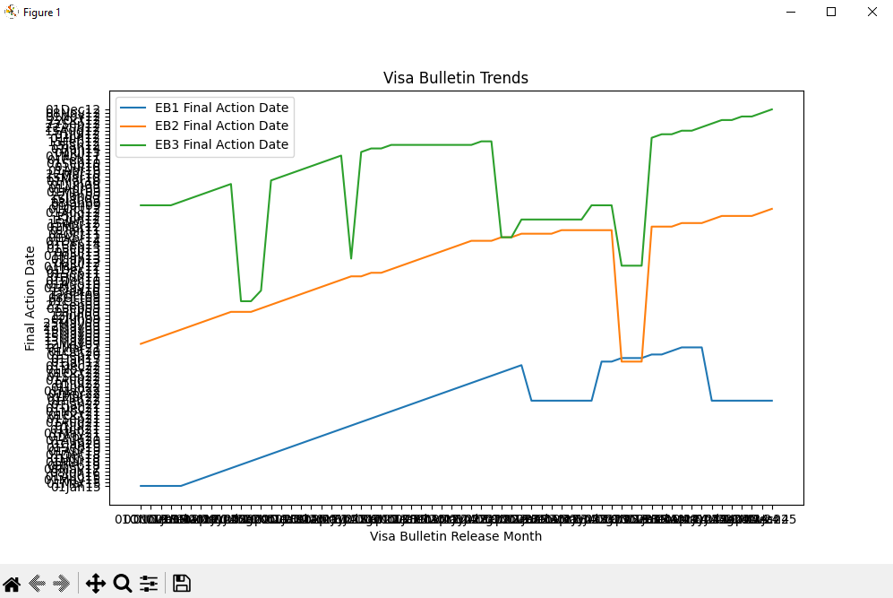

# Visa Bulletin Stats
This project extracts and visualizes data from the Visa Bulletin for India. The data is processed and saved into a CSV file, and various plots are generated to visualize the trends in visa bulletin dates.

## Requirements
Python 3.10 or higher
Required Python packages are listed in requirements.txt

## Setup
Clone the repository:

git clone https://github.com/yourusername/usa-visa-bulletin-stats.git
cd usa-visa-bulletin-stats

Create a virtual environment:

python -m venv venv
source venv/scripts/activate

pip install -r requirements.txt

## Usage
Run the script to extract and visualize the data:

The script will:

Extract data from the USA Visa Bulletin for India.
Save the data into output.csv.
Generate plots to visualize the trends in visa bulletin dates.

Output
The extracted data will be saved in output.csv.
The script will generate a plot showing the trends in visa bulletin dates for EB1, EB2, and EB3 categories.

